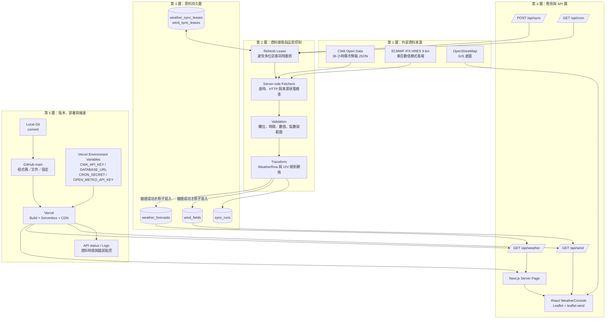
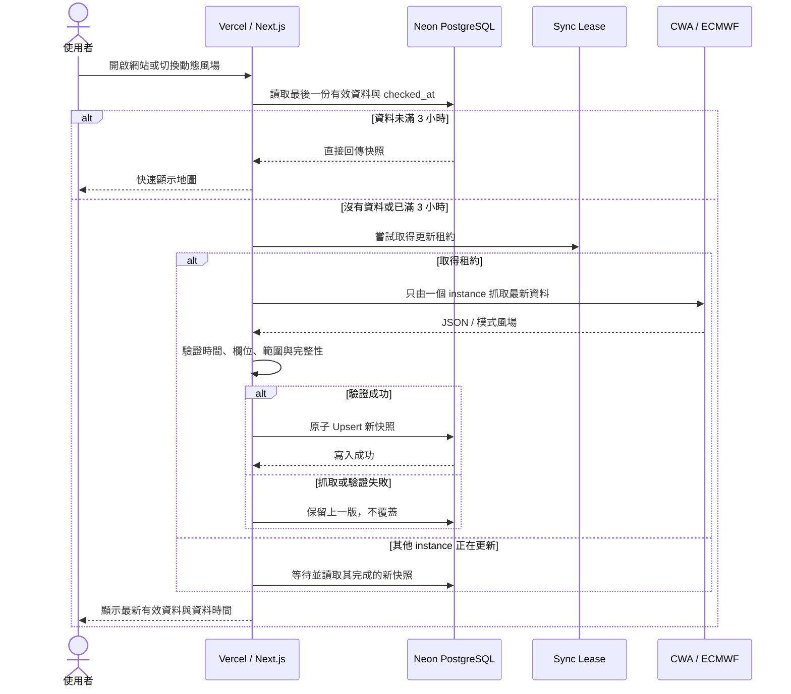
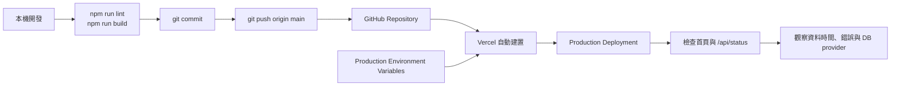

# 台灣氣象 GIS 圖台：系統架構與操作流程

本文件依照目前專案的實際程式設計，將「擷取資料 → 驗證與整理 → 寫入 DB → GitHub 版控 → Vercel 上線 → 使用者瀏覽」拆成五層。GitHub 保存原始碼與部署設定；即時氣象資料保存在 Neon PostgreSQL，不把會持續變動的正式資料庫或任何密鑰提交到 GitHub。

## 一、整體架構



## 二、五層職責與操作

| 層級 | 使用元件 | 主要操作 | 正確性保護 |
| --- | --- | --- | --- |
| 1. 外部資料來源 | CWA、ECMWF/Open-Meteo、OSM | 取得縣市預報、數值模式風場與地圖圖磚 | 畫面清楚顯示資料來源與有效時間，不把預報冒充測站即時觀測 |
| 2. 擷取與品質控制 | `lib/cwa.ts`、`lib/model-wind.ts` | Server-side fetch、JSON 解析、正規化、風速風向轉 U/V | timeout、HTTP status、空資料、時間、數值範圍、完整點數檢查；失敗不覆蓋舊資料 |
| 3. 資料持久層 | Neon PostgreSQL | Upsert 最新預報、保存風場快照、同步稽核與更新租約 | 唯一鍵防重複、租約防止 thundering herd、完整資料才原子切換 |
| 4. 應用與 API 層 | Next.js Route Handlers、React、Leaflet | SSR 首屏、REST API、圖層切換、粒子動畫、狀態提示 | API key 只留在伺服器；回傳最後一份有效資料；舊資料標示 `STALE WIND` |
| 5. 版本與部署層 | Git、GitHub、Vercel | commit、push、build、部署、環境變數與 log 監控 | GitHub 不存 `.env`；Preview/Production 分離；部署前 lint/build |

## 三、使用者進站與三小時更新流程



這個設計是「讀取時更新」（refresh-on-read），不是讓每一位使用者都重新爬一次。第一位遇到過期資料的使用者負責觸發更新；同一時間的其他使用者讀 DB 或等待同一個更新結果，可避免來源 API、Vercel Function 與 DB 瞬間被重複請求塞滿。

## 四、兩條資料管線

### A. 縣市 36 小時預報

1. `/api/weather` 或 `/api/sync` 呼叫 `weather-store`。
2. 從 Neon 讀取 `weather_forecasts` 最新快照。
3. `synced_at` 超過三小時才取得 `weather_sync_leases`。
4. `lib/cwa.ts` 使用 `CWA_API_KEY` 取得 `F-C0032-001` JSON。
5. 將 22 縣市、5 個因子、3 個時段展平成約 330 筆 `WeatherRow`。
6. 驗證非空後 Upsert，並在 `sync_runs` 記錄成功或失敗。
7. React 將溫度、降雨、天氣與舒適度疊加至 Leaflet 地圖。

### B. 東亞數值模式風場

1. 使用者切換「動態風場」後呼叫 `/api/wind`。
2. 從 `wind_fields` 讀取 ECMWF 最新有效切片。
3. `checked_at` 超過三小時才取得 `wind_sync_leases`。
4. 由 Open-Meteo 取得 ECMWF IFS HRES 9 km 的 10 m 風速與風向。
5. 抽樣為東經 105–141°、北緯 14–33°的規則網格並轉成 U/V 分量。
6. 所有點的時間、風速、風向與數量一致，才以單筆 Upsert 原子替換 `wind_fields`。
7. `leaflet-wind` 將 U/V 網格呈現為依風向流動的粒子。

ECMWF 模式每六小時產生新 run；網站每三小時檢查一次。若來源尚未釋出新 run，`checked_at` 會更新，但 `observed_at` 可以維持相同，這代表「已確認仍是最新模式」，不是假造新的模式時間。

## 五、GitHub 與 Vercel 發布流程



GitHub 的工作是保存版本與觸發部署，不是線上資料庫。正式資料流為：

```text
資料來源 → Vercel Serverless → Neon PostgreSQL → Vercel API → 使用者瀏覽器
                      ↑
GitHub 原始碼 → Vercel Build/Deploy
```

## 六、上線操作清單

1. 本機設定 `.env.local`，確認不在 Git 追蹤中。
2. 執行 `npm run lint` 與 `npm run build`。
3. Commit 並 push 到 GitHub `main`。
4. 在 Vercel Production 設定 `CWA_API_KEY`、`DATABASE_URL`、`CRON_SECRET`；商用或高流量風場另設 `OPEN_METEO_API_KEY`。
5. 由 GitHub integration 自動部署，或使用 Vercel CLI 執行 production deploy。
6. 驗收首頁、`/api/weather`、`/api/wind`、`/api/status`。
7. `/api/status` 的 `database.provider` 必須是 `neon`；若是 `memory`，代表 DB 尚未真正接上。
8. 檢查畫面的模式有效時間、最近檢查時間與 stale 狀態，不能只看部署時間。

## 七、應用層如何使用

| 使用情境 | 操作入口 | 應用層行為 |
| --- | --- | --- |
| 一般訪客打開網站 | `/` | Server Component 讀取最新縣市預報，提供可直接使用的首屏 |
| 切換氣溫／降雨／天氣／舒適度 | `WeatherConsole` 圖層按鈕 | 使用已載入的預報快照重繪 Marker，不必重新抓來源 API |
| 切換動態風場 | `WeatherConsole` → `/api/wind` | 讀 DB；必要時觸發三小時更新，再建立粒子風場 |
| 管理者手動同步 | `POST /api/sync` | 觸發 CWA 預報同步；正式環境應加管理員驗證 |
| 排程同步 | `GET /api/cron` | 驗證 `CRON_SECRET` 後執行同步 |
| 維運檢查 | `/api/status` | 確認 DB provider、筆數、最後同步時間與錯誤 |
